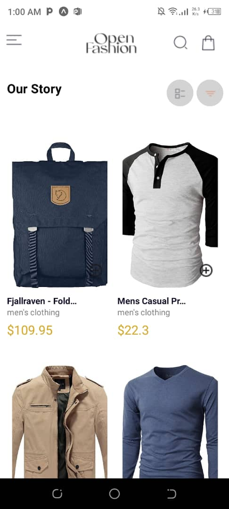
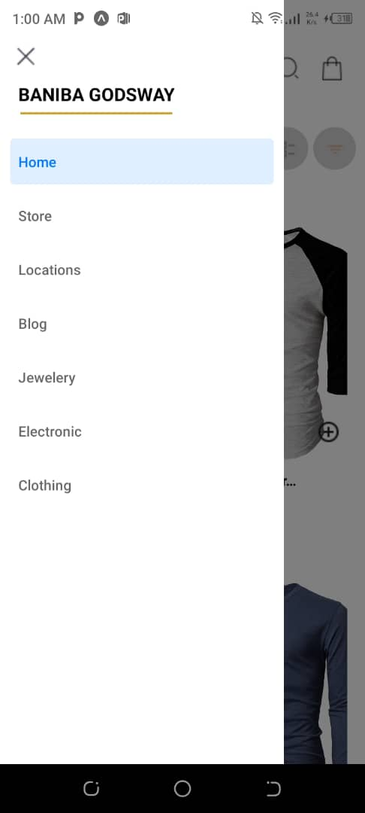
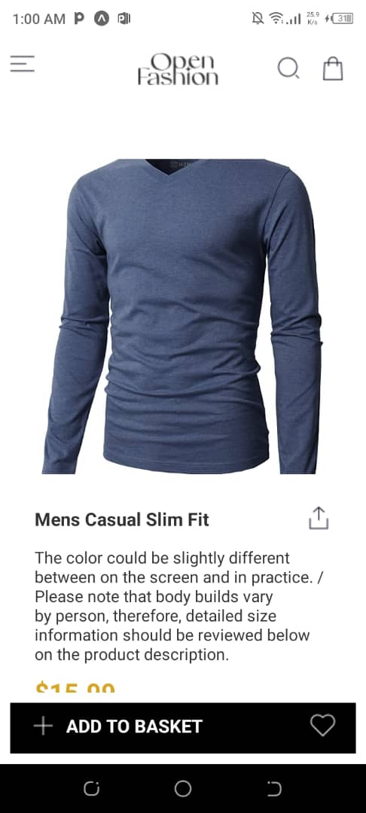

# RN Assignment 7 - [Your ID]

## Overview

This project is a mobile application built with React Native, extending the previous assignment by adding several key components and functionalities. The app allows users to view a list of products fetched from an external API, preview detailed information about each product, add products to a cart, and remove products from the cart. The cart items are stored locally on the device using AsyncStorage.

## Components

### HomeScreen
- **Purpose:** Displays a list of available products fetched from an external API.
- **Features:**
  - Fetches product data using fetch.
  - Renders the product list with an "Add to Cart" button for each product.
  - Navigates to ProductDetailScreen when a product is selected.

### ProductDetailScreen
- **Purpose:** Displays detailed information about a selected product.
- **Features:**
  - Shows product details.
  - Includes an "Add to Cart" button.

### CartScreen
- **Purpose:** Displays selected items in the cart.
- **Features:**
  - Renders a list of cart items with a "Remove from Cart" button for each item.
  - Persists cart items using AsyncStorage.

### Drawer Navigation
- **Purpose:** Provides navigation between different screens.
- **Features:**
  - Accessible through a swipe gesture or button.
  - Contains links to HomeScreen, CartScreen, and other necessary screens.

## Functionality

- **View Product List:** Users can view a list of products fetched from an external API.
- **Product Details:** Users can view detailed information about each product.
- **Add to Cart:** Users can add products to their cart.
- **Remove from Cart:** Users can remove products from their cart.
- **View Cart:** Users can view the items in their cart.

## Design Choices

### Data Fetching
- **Method:** Used fetch to retrieve data from an external API.
- **Reason:** fetch is a built-in web API that is simple and effective for making HTTP requests.

### Local Storage
- **Method:** Used AsyncStorage to store selected items locally on the device.
- **Reason:** AsyncStorage is a simple, unencrypted, asynchronous, persistent, key-value storage system that is global to the app.

### Navigation
- **Method:** Used react-navigation for drawer navigation.
- **Reason:** react-navigation is a popular navigation library for React Native, offering extensive features and support for various navigation patterns.

## Screenshots

